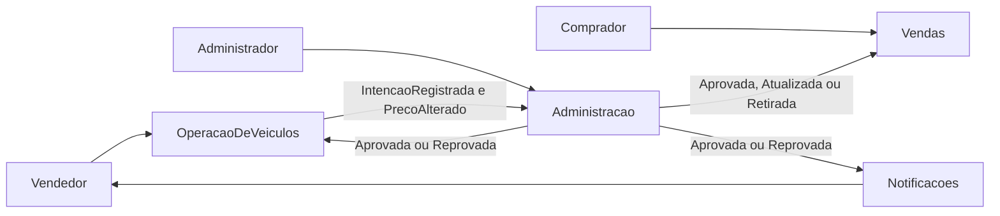

# Picareta Car

## O que é este repositório

Este repositório é um estudo de sistemas distribuídos. O objetivo é mostrar, com um exemplo acompanhável, como um mesmo processo de negócio se divide entre sistemas que não compartilham banco, se comunicam por fatos e aceitam que uma decisão e a tela de quem consulta nem sempre mudam no mesmo instante.

Ainda não há serviços, contratos executáveis nem infraestrutura. Esta etapa fixa o problema e a arquitetura alvo para o código que vier depois.

## Qual o problema do negócio

A Picareta Car é uma empresa fictícia que intermedia a compra e venda de veículos usados e seminovos. O vendedor cadastra uma intenção de venda, mas o veículo só aparece para o comprador depois de passar pela avaliação da empresa. Cadastro, avaliação, publicação, histórico de preço e notificação atravessam responsabilidades diferentes — o tipo de fronteira que o estudo quer tornar visível.

O relato completo está em [Problema de negócio](docs/dominio/problema-de-negocio.md).

## Como ler

1. [Problema de negócio](docs/dominio/problema-de-negocio.md) — o que a empresa faz e quem participa.
2. [Linguagem ubíqua](docs/dominio/linguagem-ubiqua.md) — os termos que o restante do projeto reutiliza.
3. [Contextos](docs/arquitetura/contextos.md) — quem é dono de quais dados e por que o negócio vira mais de um sistema.
4. [Fluxo e integração](docs/arquitetura/fluxo-e-integracao.md) — o ciclo de vida do veículo, os fatos que cruzam a fronteira e onde a consistência é eventual.

## Mapa dos contextos

Três áreas de negócio e uma capacidade de apoio. Notificação não é uma quarta área: ela só reage à decisão.

- **Operação de veículos** guarda a intenção de venda, o preço pedido e o histórico de alterações.
- **Administração** guarda os modelos, a faixa de preço e a decisão de aprovar ou reprovar.
- **Vendas** guarda somente a vitrine: veículos aprovados e disponíveis para o comprador.
- **Notificações** avisa o vendedor do resultado, com o motivo quando houver reprovação.

O mesmo fato "aprovada" aparece nos três contextos com papéis diferentes. A Administração emite a decisão. A Operação guarda o resultado para o vendedor. A Vendas materializa o anúncio.

## O que este repositório ainda não é

Não há código de serviços, APIs, esquemas de eventos, filas nem ambiente local. Os fatos nomeados em [Fluxo e integração](docs/arquitetura/fluxo-e-integracao.md) são o ponto de partida para esses contratos, quando a implementação começar.
