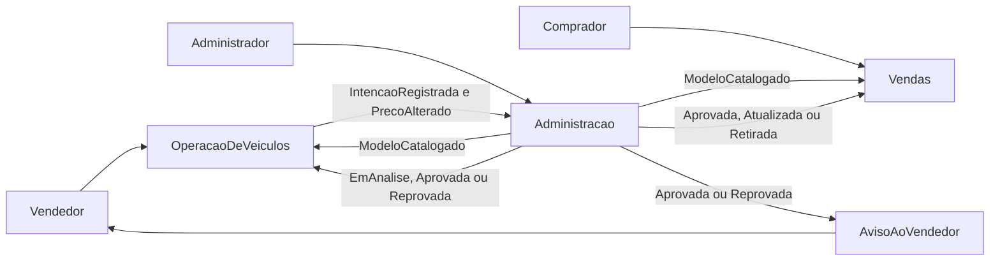

# Picareta Car

## O que é este repositório

Este repositório é um estudo de sistemas distribuídos. O objetivo é mostrar, com um exemplo acompanhável, como um mesmo processo de negócio se divide entre sistemas que não compartilham banco, se comunicam por fatos e aceitam que uma decisão e a tela de quem consulta nem sempre mudam no mesmo instante.

O problema, os contextos e as escolhas de runtime, transporte e persistência estão registrados. Ainda não há serviços, contratos executáveis nem ambiente local no repositório.

## Qual o problema do negócio

A Picareta Car é uma empresa fictícia que intermedia a compra e venda de veículos usados e seminovos. O vendedor cadastra uma intenção de venda, mas o veículo só aparece para o comprador depois de passar pela avaliação da empresa. Cadastro, avaliação, publicação, histórico de preço e notificação atravessam responsabilidades diferentes — o tipo de fronteira que o estudo quer tornar visível.

O relato completo está em [Problema de negócio](docs/dominio/problema-de-negocio.md).

## Como ler

1. [Problema de negócio](docs/dominio/problema-de-negocio.md) — o que a empresa faz e quem participa.
2. [Linguagem ubíqua](docs/dominio/linguagem-ubiqua.md) — os termos que o restante do projeto reutiliza.
3. [Contextos](docs/arquitetura/contextos.md) — quem é dono de quais dados e por que o negócio vira mais de um sistema.
4. [Fluxo e integração](docs/arquitetura/fluxo-e-integracao.md) — o ciclo de vida do veículo, os fatos que cruzam a fronteira e onde a consistência é eventual.
5. [Contextos independentes](docs/decisoes/001-contextos-independentes.md) — a premissa de que cada contexto conclui o próprio trabalho sem chamar o outro.
6. [Runtime, transporte e persistência](docs/decisoes/002-runtime-transporte-e-persistencia.md) — .NET, Kafka, três bancos no SQL Server e como o ambiente local sobe.

## Mapa dos contextos

Três áreas de negócio. O aviso ao vendedor não é área nem serviço: quando a aplicação existir, um ouvinte escreve que ele foi avisado.

- **Operação de veículos** guarda a intenção de venda, o preço pedido, o histórico de alterações e a lista de modelos que o vendedor pode escolher. Essa lista não inclui a faixa de preço.
- **Administração** guarda os modelos, a faixa de preço e a decisão de aprovar ou reprovar.
- **Vendas** guarda a vitrine e o nome dos modelos que o comprador consulta. Os veículos só entram depois da aprovação.
- **Aviso ao vendedor** não é área nem serviço. Quando a aplicação existir, um ouvinte escreve que o vendedor foi avisado, com o motivo na reprovação.

O mesmo fato "aprovada" aparece nos três contextos com papéis diferentes. A Administração emite a decisão. A Operação guarda o resultado para o vendedor. A Vendas materializa o anúncio.

## O que este repositório ainda não é

Runtime, Kafka e os três bancos estão em [Runtime, transporte e persistência](docs/decisoes/002-runtime-transporte-e-persistencia.md). Ainda não há serviços, contratos executáveis, arquivo Compose nem código. Os fatos nomeados em [Fluxo e integração](docs/arquitetura/fluxo-e-integracao.md) são o ponto de partida para esses contratos, quando a implementação começar.
