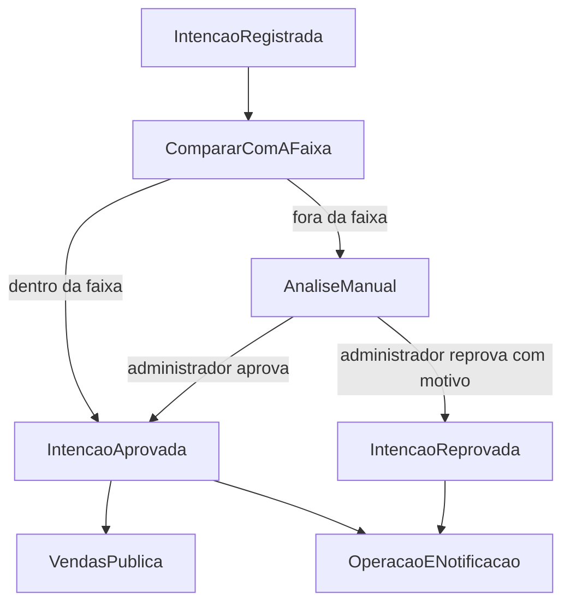

# Fluxo e integração

O cadastro não espera a faixa de preço. A Operação registra a intenção e publica o fato. A Administração compara o preço pretendido com a faixa do modelo e emite a decisão. Quem precisa reagir escuta essa decisão.

Os nomes abaixo são os fatos que cruzam a fronteira. Quando houver código, eles viram os contratos entre os contextos descritos em [Contextos](contextos.md).

## Ciclo de vida

Caminho em que o preço já nasce dentro da faixa:

**Intenção de venda → Avaliação → Aprovação → Publicação → Disponível para venda**

Caminho em que o preço nasce fora da faixa:

**Intenção de venda → Avaliação automática → Análise manual → Aprovação ou reprovação**

A reprovação encerra aquela intenção. A vitrine não muda. O vendedor recebe o motivo.

## O que cada fato carrega

- **IntencaoRegistrada** — a Operação acabou de aceitar o cadastro. Segue para a Administração. Traz a intenção, o modelo e o preço pretendido.
- **PrecoAlterado** — a Operação gravou o histórico (valor anterior, novo valor, data) e avisa a Administração. A Vendas não consome este fato cru: quem autoriza o preço visível é a Administração.
- **IntencaoAprovada** — a Administração aprovou, de forma automática ou manual. A Operação atualiza o que o vendedor acompanha. A Vendas inclui ou devolve o veículo à vitrine. Notificações avisam o vendedor.
- **IntencaoReprovada** — o administrador reprovou e informou o motivo. A Operação encerra a intenção para o vendedor. Notificações entregam o motivo. A vitrine permanece como estava.
- **AnuncioAtualizado** — o preço mudou e continua dentro da faixa. A Administração autoriza a Vendas a trocar o preço do anúncio sem tirá-lo da vitrine.
- **AnuncioRetirado** — o novo preço saiu da faixa. A Vendas tira o veículo da vitrine. A intenção volta para análise manual e só reaparece para o comprador depois de uma nova IntencaoAprovada.

## Avaliação

Dentro da faixa, ninguém espera o administrador. Fora da faixa, a intenção fica em análise até a decisão manual.

## Alteração de preço

Enquanto o veículo está sendo comercializado, o vendedor muda o preço pretendido na Operação. O histórico é gravado na hora. Em seguida a Administração reavalia:

- se o novo valor permanece na faixa, a Vendas recebe AnuncioAtualizado e o comprador passa a ver o preço novo;
- se o novo valor sai da faixa, a Vendas recebe AnuncioRetirado e o veículo deixa de aparecer até uma nova aprovação.

A vitrine nunca aplica o preço do vendedor direto. Ela só muda quando a Administração confirma que a regra comercial ainda vale.

## Consistência

O vendedor vê a intenção no ato do cadastro, porque esse registro é da Operação. O comprador só vê o veículo depois da publicação, porque a vitrine é outra base, alimentada por IntencaoAprovada.

Entre a aprovação e o anúncio existe uma janela: a decisão já foi tomada e o portal ainda pode não listar o veículo. Essa demora é consistência eventual da Vendas em relação à Administração, não uma falha do cadastro.

O mesmo vale para a retirada. Assim que o preço sai da faixa, a decisão de tirar o anúncio já existe na Administração; a vitrine some para o comprador quando AnuncioRetirado tiver sido aplicado.
