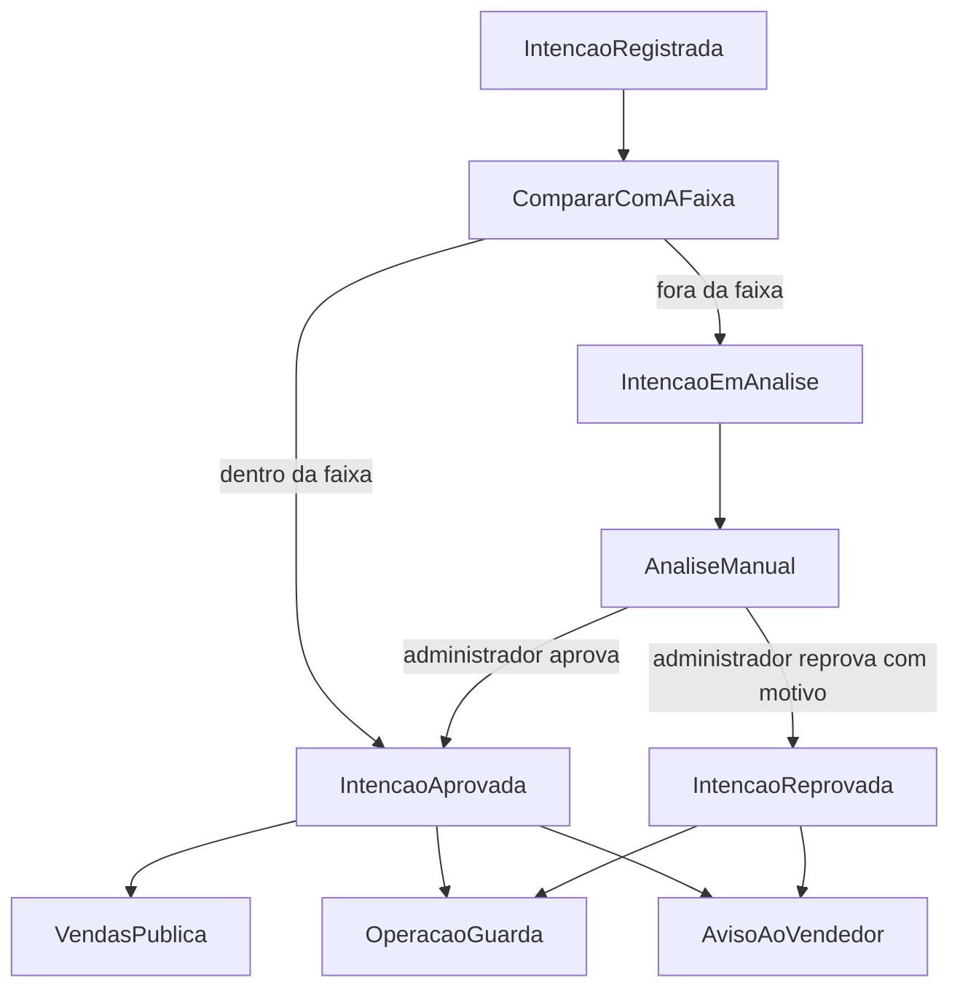

# Fluxo e integração

O cadastro não espera a faixa de preço. A Operação registra a intenção e publica o fato. A Administração compara o preço pretendido com a faixa do modelo e emite a decisão. Quem precisa reagir escuta essa decisão.

Nenhum contexto chama o outro para concluir o próprio trabalho. O fato chega completo: quem consome age com o que veio na mensagem e com o que já guardou. A premissa está em [Contextos independentes](../decisoes/001-contextos-independentes.md).

Os nomes abaixo são os fatos que cruzam a fronteira entre os contextos descritos em [Contextos](contextos.md). Quando houver código, eles viram os contratos.

## Ciclo de vida

Caminho em que o preço já nasce dentro da faixa:

**Intenção de venda → Avaliação → Aprovação → Publicação → Disponível para venda**

Caminho em que o preço nasce fora da faixa:

**Intenção de venda → Avaliação automática → Em análise → Aprovação ou reprovação**

A reprovação encerra aquela intenção. A vitrine não muda. O vendedor recebe o motivo.

## O que cada fato carrega

- **ModeloCatalogado** — a Administração passou a reconhecer um modelo. Consomem a Operação e a Vendas. Leva a identificação e o nome do modelo. Não leva a faixa de preço. A Operação usa essa cópia para o vendedor escolher o modelo. A Vendas usa para o comprador consultar os modelos. Os veículos de cada modelo só entram na vitrine por IntencaoAprovada.
- **IntencaoRegistrada** — a Operação acabou de aceitar o cadastro e marcou a intenção como recebida. Segue para a Administração. Leva a identificação da intenção, a identificação do modelo e o preço pretendido. Não leva faixa nem histórico.
- **IntencaoEmAnalise** — a Administração não aprovou sozinha porque o preço está fora da faixa. Consome a Operação, que passa a mostrar a intenção em análise. Leva a identificação da intenção. Não leva faixa nem motivo. A Vendas não consome. O aviso ao vendedor não entra.
- **PrecoAlterado** — a Operação gravou o histórico (valor anterior, novo valor, data) e avisa a Administração. Leva a identificação da intenção, o valor anterior, o novo preço pretendido e a data. A Vendas não consome este fato: quem autoriza o preço visível é a Administração.
- **IntencaoAprovada** — a Administração aprovou, de forma automática ou manual. Consomem a Operação, a Vendas e um ouvinte sem estado. Leva a identificação da intenção, a identificação e o nome do modelo e o preço pretendido aprovado. Não leva a faixa, nem se a aprovação foi automática ou manual. A Operação atualiza o que o vendedor acompanha. A Vendas inclui ou devolve o veículo à vitrine. O ouvinte escreve que o vendedor foi avisado. Quando a aplicação existir, isso é uma linha. Ele não guarda o fato.
- **IntencaoReprovada** — o administrador reprovou e informou o motivo. Consomem a Operação e um ouvinte sem estado. Leva a identificação da intenção e o motivo. A Operação encerra a intenção para o vendedor. O ouvinte escreve o aviso com o motivo. A Vendas não consome: a vitrine permanece como estava.
- **AnuncioAtualizado** — o preço mudou e continua dentro da faixa. A Administração autoriza a Vendas a trocar o preço do anúncio sem tirá-lo da vitrine. Leva a identificação da intenção e o preço visível. A Operação não consome: o histórico ela já gravou no próprio contexto.
- **AnuncioRetirado** — o novo preço saiu da faixa. Consome a Vendas, que tira o veículo da vitrine. Leva a identificação da intenção. A intenção volta para análise na Operação por IntencaoEmAnalise, não por este fato. O veículo só reaparece para o comprador depois de uma nova IntencaoAprovada.

Se a Administração receber uma intenção cujo modelo não está no catálogo dela, não emite decisão. A intenção permanece recebida na Operação.

## Avaliação

Dentro da faixa, ninguém espera o administrador. Fora da faixa, a Operação fica sabendo por IntencaoEmAnalise e a intenção permanece assim até a decisão manual.

## Alteração de preço

Enquanto o veículo está sendo comercializado, o vendedor muda o preço pretendido na Operação. O histórico é gravado na hora. Em seguida a Administração reavalia:

- se o novo valor permanece na faixa, a Vendas recebe AnuncioAtualizado e o comprador passa a ver o preço novo;
- se o novo valor sai da faixa, a Vendas recebe AnuncioRetirado e a Operação recebe IntencaoEmAnalise. O veículo deixa de aparecer até uma nova aprovação, e o vendedor volta a ver a intenção em análise.

A vitrine nunca aplica o preço do vendedor direto. Ela só muda quando a Administração confirma que a regra comercial ainda vale.

## Consistência

O vendedor vê a intenção no ato do cadastro, porque esse registro é da Operação. O comprador só vê o veículo depois da publicação, porque a vitrine é outra base, alimentada por IntencaoAprovada.

Entre a aprovação e o anúncio existe uma janela: a decisão já foi tomada e o portal ainda pode não listar o veículo. Essa demora é consistência eventual da Vendas em relação à Administração, não uma falha do cadastro.

O mesmo vale para a retirada. Assim que o preço sai da faixa, a decisão de tirar o anúncio já existe na Administração; a vitrine some para o comprador quando AnuncioRetirado tiver sido aplicado. A Operação mostra "em análise" quando IntencaoEmAnalise tiver sido aplicado, não quando a vitrine já tiver sumido.

A lista de modelos tem a mesma defasagem. A Administração já reconhece o modelo; a Operação e a Vendas só o oferecem depois de ModeloCatalogado.
